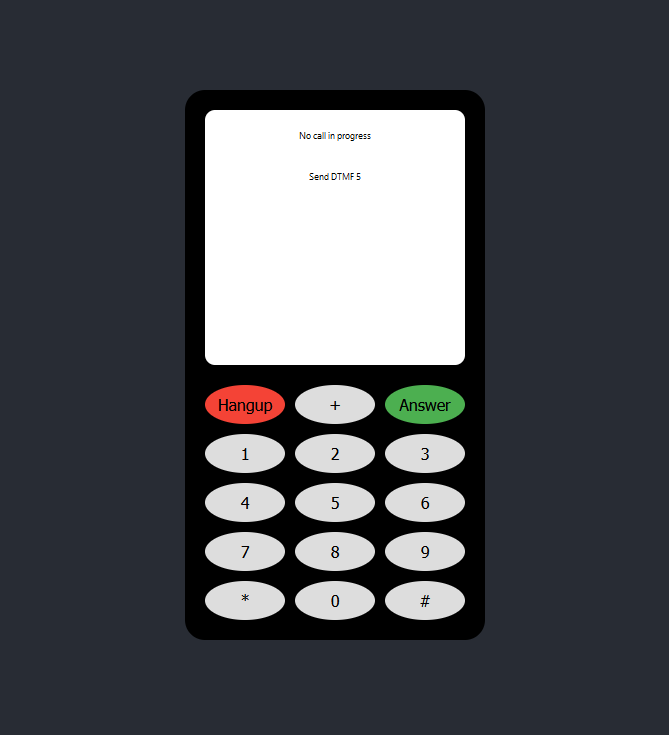

# WebRTC SIP Phone Tester

## Features

- Make and receive calls via SIP
- Use Turn server for NAT traversal
- Hang up and answer calls
- DTMF support
- Display call status

## Requirements

To run this project, you will need:

- A WebRTC-compatible SIP server
- Credentials for the SIP server
- NodeJs and npm installed on your machine

## Installation

    Clone the repository:
      git clone https://github.com/fetristan/webrtc-sip-phone.git
    Navigate to the project directory:
      cd webrtc-sip-phone 
    Install dependencies:
      npm install 
    Copy the .env_example file to a new file named .env:
      cp .env_example .env 
    Fill in the .env file with your SIP server and credentials.

## Usage

To start the application, run:

    npm start

The application will be available at http://localhost:3000.

## Configuration

Set up your SIP server and credentials in the .env file:

      REACT_APP_SERVER=wss://your-sip-server.com:7443
      REACT_APP_URI_STRING=sip:your-username@your-sip-server.com
      REACT_APP_AUTHORIZATION_PASSWORD=your-password
      REACT_APP_AUTHORIZATION_USERNAME=your-username
      REACT_APP_TARGET_URI_STRING=sip:target-number@target-sip-server.com:5080
      REACT_APP_TURN_SERVER=turn:your-turn-server.com:3478
      REACT_APP_TURN_SERVER_NAME=your-turn-server.com
      REACT_APP_TURN_AUTH_SECRET=your-turn-auth-secret
      REACT_APP_TURN_AUTH_EXPIRY=3600

Replace the placeholders with your actual server details.

## Testing Calls

To make a call to the target, press the '+' button.

To answer an incoming call, press the 'Answer' button when you see an incoming call notification.

To hang up an active call, press the 'Hangup' button.

To use DTMF, press the buttons on the dial pad.

## Contributing

Contributions are welcome! Please feel free to submit a pull request or create an issue for bugs, questions, or new features.